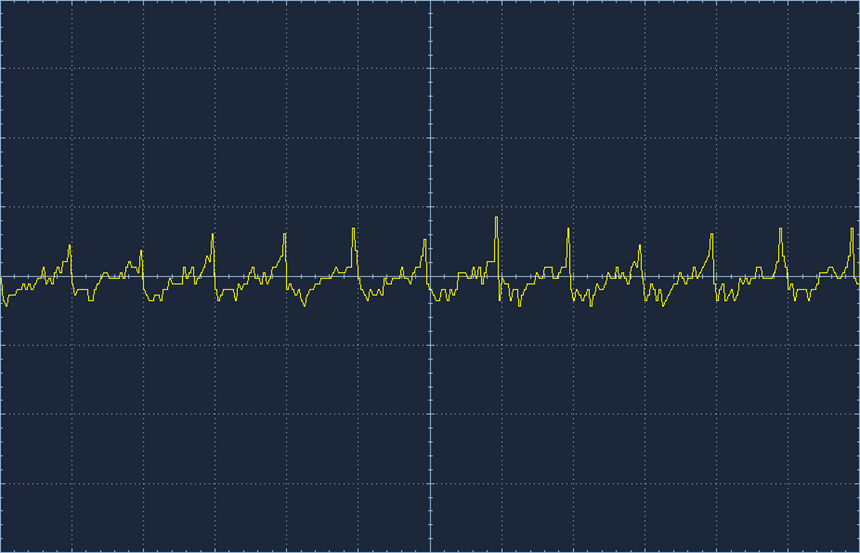
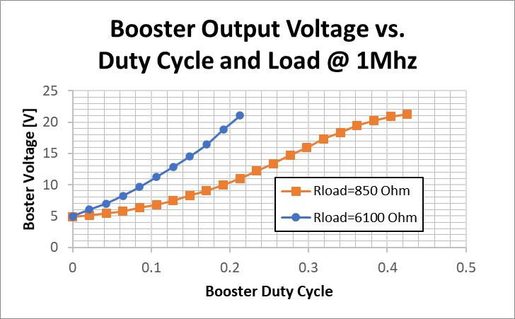
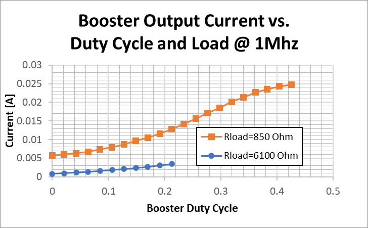
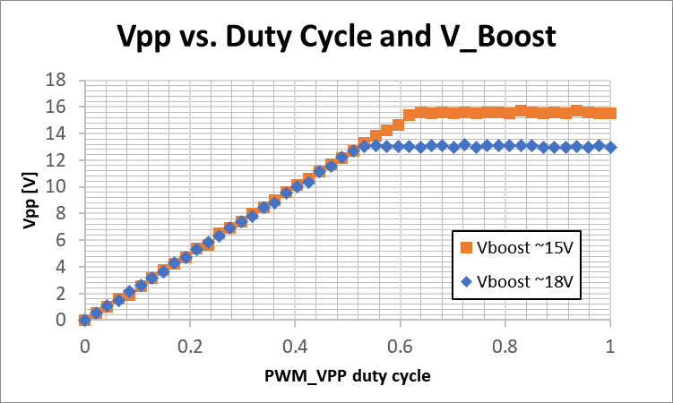
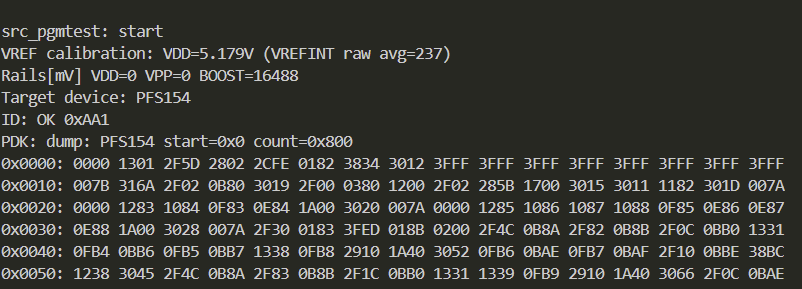
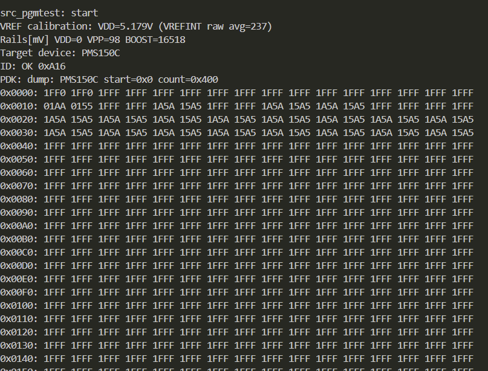
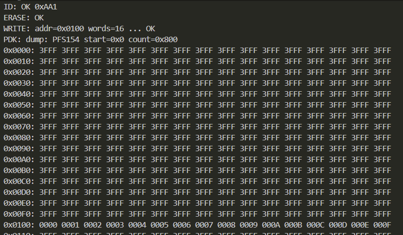

# Design

Design notes, simulations, and captured results while bringing up the Splinter hardware.

## Contents

- `SimpleBoost_V4_simple.asc` / `SimpleBoost_V5_opamp.asc` - LTspice simulations for the boost converter and op-amp control loop.
- `booster.xlsx` - sizing / calculator spreadsheet for the booster.
- `screenshots/` - captured results from bring-up experiments (`Firmware/src_pgmtest/` and `Firmware/src_boostertest/`).

## Bring-up / Verification

This section collects notes and captures from bring-up experiments across the firmware test applications.
For implementation details, see `Firmware/src_boostertest/README.md` and `Firmware/src_pgmtest/README.md`.

### Booster electrical characterization (Firmware/src_boostertest)

#### Booster ripple

Booster frequency was set so Vboost ~15V, 1 kohm load. Scope settings: 1 us/div (horizontal) and 50 mV/div (vertical). Measured ripple: 64 mV Vpp. The ripple remained similar across load conditions.

#### Booster voltage vs duty cycle and load

#### Booster current vs duty cycle and load

#### VPP vs PWM_VPP and VBOOST

### PDK programming (Firmware/src_pgmtest)

Bring-up notes (duplicated from the firmware README):
- Target pin mapping: PC5=ICPCK, PC6=MOSI (3-wire only), PC7=ICPDA/MISO (2-wire data or 3-wire MISO).
- Power sequencing: VDD/VPP are derived from BOOST; keep VDD/VPP at 0V while enabling BOOST, then cycle VDD/VPP per programming step.
- IO level note: without level shifting, we keep target VDD close to ~5V during bring-up for reliable GPIO logic levels.

#### PFS154 read

#### PMS150C read

#### PFS154 erase + write + read

16 words were written starting at address `0x0100` (test pattern `0x0000..x000f`).
