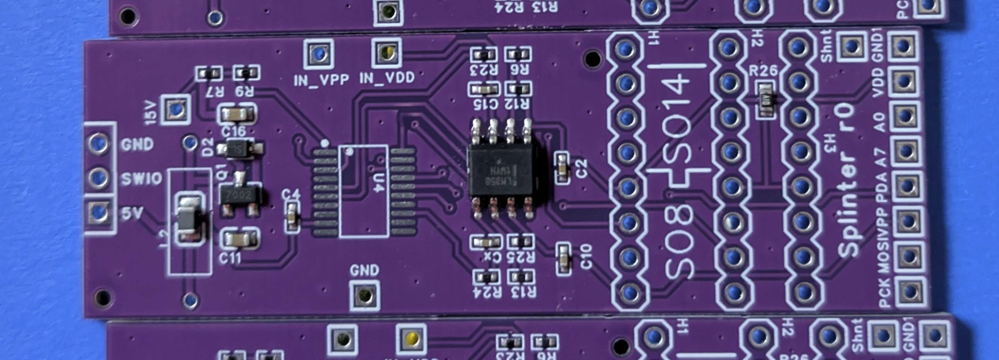

# Splinter

Experiments towards a programmer for the "$0.03 MCUs" based on a WCH CH32V003.

## Repo Layout

- `Design/` - design notes and sims (LTspice `.asc`, sizing spreadsheet)
- `Firmware/` - firmware sources + build environment (ch32fun)
- `Testboards/` - hardware test boards (schematics/PCB docs)

## Firmware 

`Firmware/src_boostertest/` - test firmware for the boost converter and voltage regulation.

`Firmware/src_pgmtest/` - Padauk (PDK) programmer test firmware (ID read / dump / erase / write experiments).
