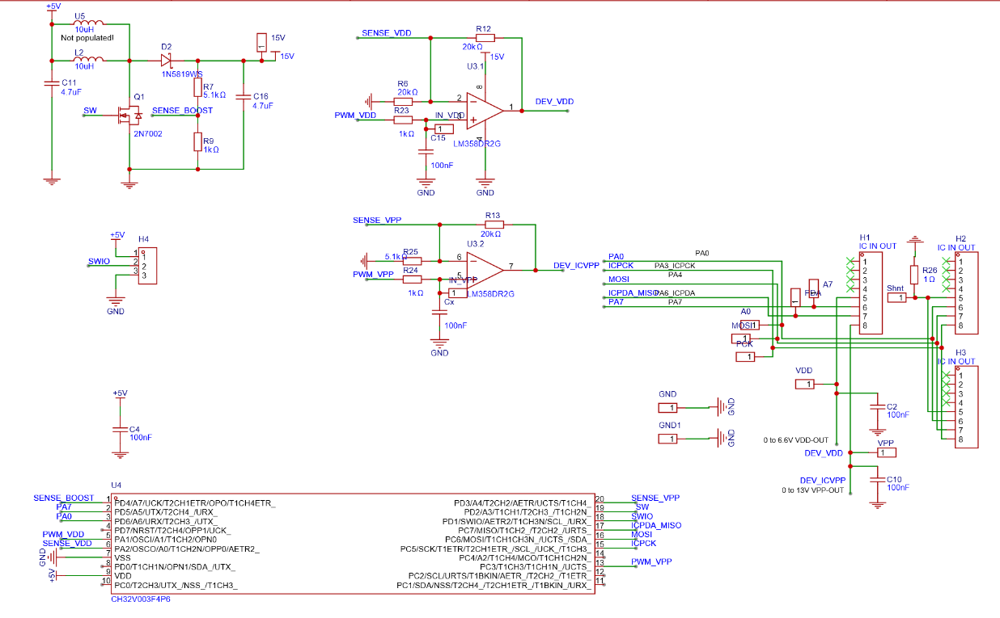

# Splinter

Experiments towards a programmer for the Padauk 8-Bit MCUs based on a WCH CH32V003. The goal is to allow for a programmer with a BOM <$0.50, fitting for a $0.03 MCU. This initialial phase covers voltage generators and programming algorithms, integration with [rv003usb](https://github.com/cnlohr/rv003usb) is anticipated as a later step. 

One of the more ambitious design choices is to use a boost converter built around discrete components and the microcontroller itself, used as switching signal generator and software feedback control. This allows reducing reliance on a booster ICs, which costs significantly more and is often not available. A common LM358 OPamp is used as a linear regulator to control supply voltages for the target device.

Hardware conceptualization, architecture and design was done manually using LTSpice and EasyEDA, based on [Easy-PDK-Programmer lite](https://github.com/free-pdk/easy-pdk-programmer-lite-hardware)

Bringup and documentation with agentic GenAI (Claude Code and Codex), using [earlier experiements](https://github.com/cpldcpu/SimPad) and the [free-pkd Firmware ](https://github.com/free-pdk/easy-pdk-programmer-software) as references. The Firmware is based on [ch32fun](https://github.com/cnlohr/ch32fun)
### Schematics

### Partially popoulated PCB of test build

## Repo Layout

- [`Design/`](Design/) - design notes and sims (LTspice `.asc`, sizing spreadsheet)
- [`Firmware/`](Firmware/) - firmware sources + build environment (ch32fun)
- [`Testboards/`](Testboards/) - hardware test boards (schematics/PCB docs)

## Bring-up / Verification

Bring-up notes and captures (booster electrical characterization + PDK programming experiments) live in [`Design/README.md`](Design/README.md).

## Firmware

Firmware details and build notes live in [`Firmware/README.md`](Firmware/README.md).

## Licensing

- Hardware design in [`Testboards/`](Testboards/) is released under CC-BY-SA-4.0.
- Firmware under [`Firmware/src_*`](Firmware/) is built on top of [`Firmware/ch32fun`](Firmware/ch32fun/) (MIT).
